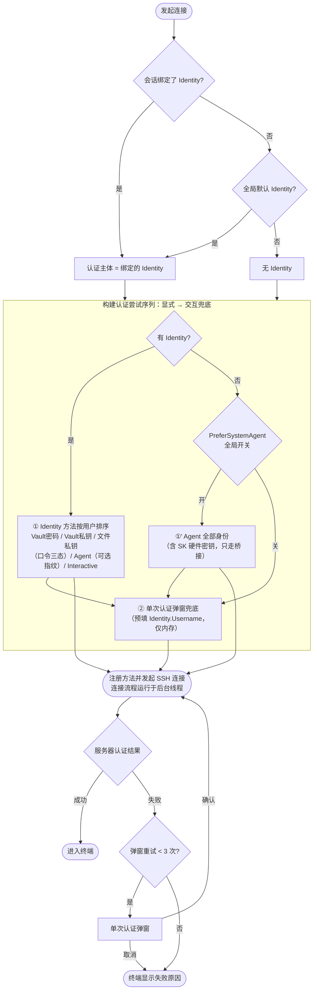
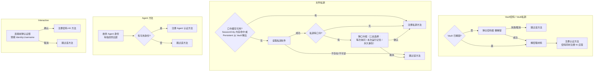
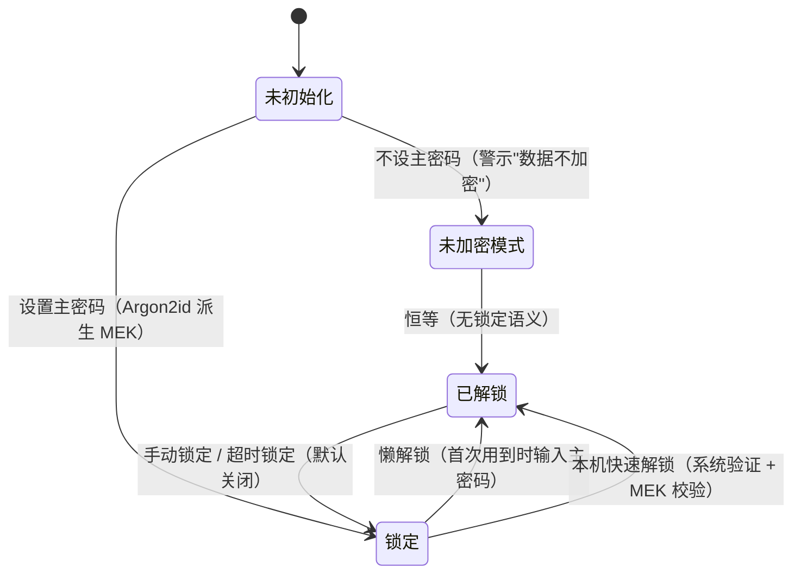
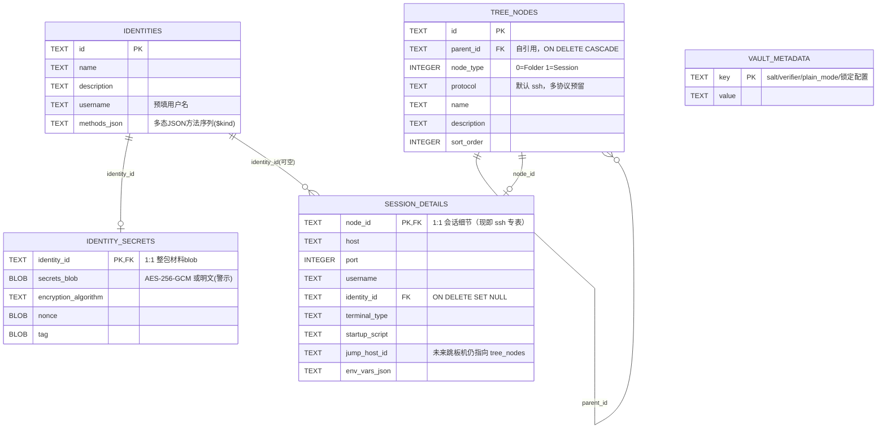

# 06 - 身份（Identity）与认证编排设计

> 状态：已评审定稿（2026-09-23）。取代 [02-vault-and-credentials.md](./02-vault-and-credentials.md) 中的单凭据模型；
> 02 的存储加密流程（Argon2id / AES-256-GCM / 表结构）仍有效并被本文引用。

---

## 1. 背景与设计原则

- 目录组配置继承已废弃（见 01 文档修订）：文件夹是纯分类容器，配置解析为
  「会话自身 → 全局设置 → 内建兜底」扁平三层。
- 认证体验对齐 SecureCRT / JuiceSSH / Xshell：**命名隔离的身份档案**，会话绑定身份，
  身份内部配置**有序的多种认证方法**（密钥失败回退密码等）。
- 原则：**显式声明永远优先于全局兜底**；密钥材料**仅内存流转**，绝不写入明文日志或未加密文件；
  SK 硬件密钥**只经 SSH-Agent 桥接**（不绑 Yubico/CTAP2）。

## 2. 命名决策

- 领域/UI 名称统一为 **Identity（身份）**。弃用 "Profile"（与 PuTTY/WireGuard 语境的
  「会话配置档」撞车），弃用裸 "Credential"（语义弱化为单条凭据，承载不了多方法序列）。
- SQLite 表由 `credentials` 迁移为 `identities`（`ALTER TABLE ... RENAME`，附带列适配）。

## 3. 领域模型

```csharp
public class Identity
{
    public Guid Id { get; set; } = Guid.NewGuid();
    public string Name { get; set; } = string.Empty;
    public string? Description { get; set; }
    public string? Username { get; set; }          // 预填用户名（Interactive/弹窗兜底时使用）
    public List<AuthMethodEntry> Methods { get; set; } = [];  // 持久化为 methods_json（多态 JSON），数组序 = 尝试序
    public DateTime CreatedAt { get; set; }
    public DateTime UpdatedAt { get; set; }
}

// 多态序列化：System.Text.Json 原生支持（.NET 7+ 的 [JsonPolymorphic]/[JsonDerivedType]），
// 无需 Newtonsoft。判别符写 $kind，未知类型反序列化直接抛错（防静默丢方法）。
[JsonPolymorphic(TypeDiscriminatorPropertyName = "$kind",
                 UnknownDerivedTypeHandling = JsonUnknownDerivedTypeHandling.ThrowSerialization)]
[JsonDerivedType(typeof(VaultPasswordMethod), "ssh/vault-password")]
[JsonDerivedType(typeof(VaultPrivateKeyMethod), "ssh/vault-key")]
[JsonDerivedType(typeof(FilePrivateKeyMethod), "ssh/file-key")]
[JsonDerivedType(typeof(AgentMethod), "ssh/agent")]
[JsonDerivedType(typeof(InteractiveMethod), "ssh/interactive")]
public abstract class AuthMethodEntry
{
    public Guid Id { get; set; } = Guid.NewGuid();   // identity_secrets 材料映射（methodId -> SecretPayload）的键
    public int SortOrder { get; set; }
    public bool Enabled { get; set; } = true;
    // 未来协议方法：派生新子类 + 追加一行 [JsonDerivedType]（如 "vnc/password"），零 DDL 迁移
}

public sealed class VaultPasswordMethod : AuthMethodEntry { }     // 密码，密文存 Vault
public sealed class VaultPrivateKeyMethod : AuthMethodEntry { }   // 私钥密文托管

public sealed class FilePrivateKeyMethod : AuthMethodEntry        // 文件引用（只存路径）
{
    public string? KeyFilePath { get; set; }
    public PassphrasePersistence PassphraseMode { get; set; } = PassphrasePersistence.AlwaysAsk;
}

public sealed class AgentMethod : AuthMethodEntry                 // 走系统 Agent（可排进方法序列）
{
    public string? AgentFingerprint { get; set; }   // 可选；空 = 全部身份（指纹 UI 二期）
}

public sealed class InteractiveMethod : AuthMethodEntry { }       // 每次连接弹窗，仅记用户名

public enum PassphrasePersistence   // 文件私钥口令三态
{
    AlwaysAsk   = 0,   // 每次连接询问
    SessionOnly = 1,   // 本次运行内存缓存（锁定/退出清空）
    Persistent  = 2    // 永久保存（入 Vault 密文，材料映射内按 methodId 键控）
}
```

- `SecretPayload`（Password / PrivateKeyContent / Passphrase）保持不变，仍仅内存流转。
- 一个 Identity 至少一个启用方法；方法在连接前**物化**（取材料/问口令），物化失败跳过顺延。

## 4. Vault（主密码可选）

- **不设主密码**：允许，启动时与设置页明确警示「密钥材料不加密存储」；落库为明文但结构不变
  （`vault_metadata.plain_mode = 1`），未来可无损升级为加密模式。
- **设主密码**：Argon2id（salt 16B, m=64MB, t=3, p=4）派生 32B MEK；AES-256-GCM 加密，
  blob 格式 `[salt 16B][nonce 12B][tag 16B][ciphertext]`。
- **解锁策略**：懒解锁——首次用到 Vault 材料时弹主密码框；纯 Agent/文件私钥用户永不被打扰。
- **锁定超时**：实现，设置可配，**默认关闭**。锁定 = 清内存 MEK 与口令缓存。
- **本机快速解锁**：macOS Touch ID / Windows Hello 显式验证后，读取系统保护的 MEK 副本，
  不保存主密码，不在启动或自动重连时静默解锁。启用需再次输入主密码，始终保留密码入口。
  登记仅在本机生效，不随配置导出；更换主密码会撤销旧登记。Linux 尚未实现。
  详见 [14-vault-quick-unlock.md](./14-vault-quick-unlock.md)。

## 5. 连接编排（决策树）

规则：**显式优先，环境补充，交互兜底**。
绑定了 Identity（会话级 → 全局默认级）时，完全按 Identity 方法序列尝试（含其中的 Agent 方法），
全局 `PreferSystemAgent` 不再注入；未绑定任何 Identity 时，`PreferSystemAgent` 决定是否先试
Agent，再进单次弹窗兜底。



**方法物化子流程**



- 认证失败回弹：连接流程移入后台线程，UI 输入框经 Dispatcher 桥接——**认证失败自动回弹
  单次输入框（上限 3 次）**，keyboard-interactive 服务器提示可真交互（2FA 可用）。
- 全部方法跳过且用户取消兜底弹窗 → 终端显示失败原因。

## 6. Vault 状态机



## 7. SQLite 建模

```sql
-- 身份表：方法序列以多态 JSON 存储（$kind 判别，数组序 = 尝试序）
CREATE TABLE identities (
    id TEXT PRIMARY KEY NOT NULL,
    name TEXT NOT NULL,
    description TEXT,
    username TEXT,
    methods_json TEXT NOT NULL DEFAULT '[]',
    created_at TEXT NOT NULL,
    updated_at TEXT NOT NULL
);

-- 每身份一个整包密钥材料 blob：内部为 { methodId: SecretPayload } 映射，整体 AES-256-GCM；
-- 明文模式下为原始 JSON 字节（UI 已警示不加密）。会话绑定身份后，身份删除 → 级联清材料。
CREATE TABLE identity_secrets (
    identity_id TEXT PRIMARY KEY NOT NULL REFERENCES identities(id) ON DELETE CASCADE,
    secrets_blob BLOB NOT NULL,
    encryption_algorithm TEXT NOT NULL DEFAULT 'AES-256-GCM',
    nonce BLOB,
    tag BLOB
);

-- Vault 全局元数据（salt / 校验 blob / plain_mode 标志 / 自动锁定配置）
CREATE TABLE IF NOT EXISTS vault_metadata (
    key TEXT PRIMARY KEY NOT NULL,
    value TEXT NOT NULL
);

-- 会话绑定身份：credential_id 改名 identity_id 并挂 FK，删除身份时置空（回退到全局默认/弹窗）
-- session_details: identity_id TEXT REFERENCES identities(id) ON DELETE SET NULL
```

### 7.1 ER 图



- 所有连接表保持 `PRAGMA foreign_keys = ON`。
- 迁移（旧库）：`credentials` 行元数据重建为 `identities`（name/description/username 迁入，
  旧 cred_type 映射为单个等价方法写入 methods_json；旧表从未实现密钥材料，无秘密可迁）；
  `session_details.credential_id` 改列 `identity_id` + FK；`session_details` 其余结构不变。

## 8. 多协议适配（建模预留，一期不实现）

- `tree_nodes` 增加 `protocol TEXT NOT NULL DEFAULT 'ssh'` 列（一期加列，零成本）。
- 协议骨架在 `tree_nodes`，协议细节在各自 detail 表（现有 `session_details` 即
  `session_details_ssh` 之实；未来 `session_details_vnc` / `session_details_s3` 平级新建）。
- Identity 保持协议无关；方法类型按协议命名空间扩展（`ssh:*`、未来 `vnc:Password`、
  `s3:AccessKey`），编辑器按会话协议过滤可选方法类型。
- `ResolvedSessionConfig` 未来抽象为协议配置接口 + 各协议子配置。

## 9. UI 变更点

- 「凭据管理器」→「身份管理器」：Identity 列表 + 编辑器（名称/描述/用户名/有序方法列表）。
- 方法行内编辑：Vault 方法无额外字段；文件私钥填路径 + 口令三态；Agent 方法可选指纹（二期 UI）。
- 会话编辑器：绑定身份下拉（含「不绑定」）；设置页：默认身份下拉 + PreferSystemAgent 开关
  （仅无绑定场景生效，开关描述文案注明）。
- 单次认证弹窗、主密码懒解锁框、口令三态框共用深色主题与输入风格。

## 10. 分期

| 阶段 | 内容 |
|---|---|
| **一期** | identities/identity_secrets/vault_metadata 三表（方法多态 JSON）+ 旧表迁移；Vault（可选主密码、懒解锁、超时默认关）；文件私钥口令三态；Agent 方法（全量身份）；Interactive；失败回弹重试编排（后台线程 + KI 真交互）；身份管理器与绑定接线；tree_nodes.protocol 列；单元测试 |
| **二期** | Linux 本机快速解锁；Agent 指纹绑定 UI |
| **三期** | 1Password / Bitwarden / OpenBao 适配器；SSH 证书；VNC / S3 协议落地 |

## 11. 测试要点（Core 层纯逻辑）

- 编排计划构建：有/无 Identity × PreferSystemAgent 四象限；方法排序与 Enabled 过滤。
- 方法物化：Vault 锁定时跳过顺延；文件不存在跳过；口令三态行为；Agent 无身份跳过。
- Vault：主密码设置/校验、明文模式标志、加解密往返、锁定清缓存（MEK + SessionOnly 口令）。
- 三态口令持久化：Persistent 口令进入 identity_secrets 整包映射（methodId 键控），随身份级联删除。
- 多态 JSON 往返：序列化含 $kind 判别符、反序列化命中各子类、未知 $kind 抛错、数组序保持。
