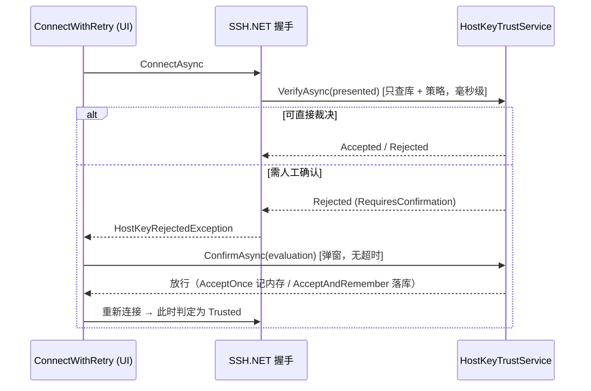

# 07 - 主机密钥信任与连接可达性（Host Keys & Connectivity）

> 状态：一期已实现（2026-09）。确认弹窗 UI 待做，未提供前按「未知主机 TOFU、变更阻断」运行。

---

## 1. 主机密钥信任

### 1.1 目标

- 首次连接记录服务器公钥；之后密钥**变更必须阻断**（防中间人），由用户明确决定是否替换。
- 与系统 OpenSSH 互通：可导入 `~/.ssh/known_hosts`（含 `HashKnownHosts` 哈希条目、通配符、`@revoked`）。
- 指纹展示与 `ssh-keygen -l` 完全一致（`SHA256:` + 无填充 Base64），方便用户与服务器控制台比对。

### 1.2 模型（`Kei.Term.Core.Security`）

| 类型 | 说明 |
|---|---|
| `KnownHostEntry` | 信任条目。`Port > 0` 为精确条目（主机名小写）；`Port = 0` 为模式条目，`Host` 保存 OpenSSH 原始模式串（端口语义编码在模式里） |
| `PresentedHostKey` | 握手中服务器呈现的公钥 blob，Host/Port 为**逻辑地址**（经跳板时不是 127.0.0.1） |
| `HostKeyVerdict` | `Trusted` / `Unknown` / `Changed` / `Revoked` |
| `HostKeyPolicy` | `Ask`（默认）/ `AcceptNew`（= `StrictHostKeyChecking=accept-new`）/ `Strict` |
| `HostKeyDecision` | `Reject` / `AcceptOnce`（本进程内有效，不落库）/ `AcceptAndRemember` |

判定规则（`HostKeyVerifier.Evaluate`）：

1. 同一把钥匙存在吊销条目 → `Revoked`（优先于信任）。
2. 同一把钥匙存在信任条目 → `Trusted`。
3. 同算法已有**不同**的信任钥匙 → `Changed`。
4. 否则 `Unknown`（包括"只登记过其它算法的钥匙"：SSH.NET 不会按已知算法排序协商，服务器换了协商算法很常见，不应误报篡改）。

策略矩阵（`DecideWithoutPrompt`）：

| 判定 \ 策略 | Ask | AcceptNew | Strict |
|---|---|---|---|
| Trusted | 放行 | 放行 | 放行 |
| Unknown | **需确认** | 记住并放行 | 拒绝 |
| Changed | **需确认**（强警示） | 拒绝 | 拒绝 |
| Revoked | 拒绝（不可确认） | 拒绝 | 拒绝 |

### 1.3 两段式确认（关键设计）

SSH.NET 的 `HostKeyReceived` 在密钥交换中同步触发，而握手整体受 `ConnectionInfo.Timeout` 约束（默认 15 秒）。
若在回调里弹窗等用户读指纹，超时会先于用户决定到达。因此：



- 同一次连接最多确认 2 次（防止每次呈现不同密钥的服务器导致无限弹窗）。
- `HostKeyRejectedException` 与认证失败区分：不会回弹密码框。
- 校验自身故障（如数据库不可用）按**拒绝**处理，安全检查失败不能退化为放行。
- 未注入确认 UI（当前状态）时 `Ask` 退化为：未知主机 TOFU 记录、变更一律阻断。

### 1.4 存储（迁移 v2）

```sql
CREATE TABLE known_hosts (
    id TEXT PRIMARY KEY NOT NULL,
    host TEXT NOT NULL,               -- 精确：小写主机名；模式：OpenSSH 原始模式串
    port INTEGER NOT NULL,            -- 0 = 模式条目
    key_type TEXT NOT NULL,
    public_key TEXT NOT NULL,         -- Base64 wire-format blob
    fingerprint_sha256 TEXT NOT NULL,
    status INTEGER NOT NULL DEFAULT 0,  -- 0 Trusted / 1 Revoked
    source INTEGER NOT NULL DEFAULT 0,  -- 0 FirstUse / 1 UserConfirmed / 2 Imported
    comment TEXT,
    created_at TEXT NOT NULL,
    last_seen_at TEXT,
    UNIQUE(host, port, public_key)
);
CREATE INDEX idx_known_hosts_endpoint ON known_hosts(host, port);
```

候选查询 = 该端点精确条目 + 全部模式条目，最终匹配（哈希 HMAC-SHA1、通配符、否定）在内存完成。

### 1.5 待办

- 确认弹窗 UI：展示主机、算法、指纹、之前记录的指纹（`HostKeyEvaluation.KnownEntries`）；`Changed` 使用红色强警示并默认焦点在「拒绝」。
  注入方式：`new HostKeyTrustService(repo, policy, prompt: evaluation => dialog...)`。
- 设置页：策略三选一；信任库管理列表（删除 / 标记吊销 / 导出为 known_hosts）。
- SSH 证书（`@cert-authority`）目前在导入时跳过，随证书认证一起做。

---

## 2. 跳板链（ProxyJump）

- 会话的 `JumpHostSessionId` 指向另一个**普通会话节点**；跳板自身也可以再有跳板 → 多级链。
- `JumpChainResolver`（Core，纯逻辑）由目标向外追溯并反转为「由外到内」顺序，检测循环、缺失节点、超过 8 级。
- App 逐跳复用完整的认证管线（身份 → 计划 → 物化 → 必要时弹窗），每跳一个 `SshHop`。
- `SshJumpChain`（Ssh 层）：第一跳直连，其后每一跳经上一跳的 `127.0.0.1:0` 临时转发口拨号；
  每一跳的主机密钥都按其**逻辑地址**校验和登记。
- 文件通道（SFTP/SCP）借用终端会话已建立的链，只在链尾多开一个转发口，不再重复登录各跳。

## 3. 其它连接选项（`SshConnectOptions`）

| 选项 | 来源设置 | 说明 |
|---|---|---|
| `ConnectTimeout` | `ConnectTimeoutSeconds` | 每一跳分别生效 |
| `KeepAliveInterval` | `KeepAliveIntervalSeconds` | 0 关闭；防 NAT/防火墙静默回收空闲连接 |
| `AgentSocketPath` | `CustomAgentSocketPath` | 空 = 系统默认；`pageant` = PuTTY Pageant；其它 = socket / 命名管道路径 |
| `InteractivePrompt` | — | keyboard-interactive 真交互（2FA） |
| `HostKeyValidator` | `HostKeyPolicy` | 见 §1 |
| `JumpHosts` | 会话 `JumpHostSessionId` | 见 §2 |

登录脚本：会话 `StartupScript` 在 shell 打开后逐行以回车提交。

## 4. 导入

| 来源 | 入口 | 行为 |
|---|---|---|
| `~/.ssh/config` | 文件 → 导入 OpenSSH 配置 | 具体 `Host` 别名 → 会话（放入根目录「SSH Config」文件夹）；`IdentityFile` 组合 → 共享身份（`IdentitiesOnly=yes` 时不含 Agent 方法）；`ProxyJump` → 跳板链（未声明的跳板主机按需建临时会话）；`Include` 支持通配；`Match` 块跳过；`ProxyCommand` 暂不支持（给出警告）。重复导入跳过同名会话。 |
| `~/.ssh/known_hosts` | 文件 → 导入主机密钥 | 见 §1；幂等写入 |
