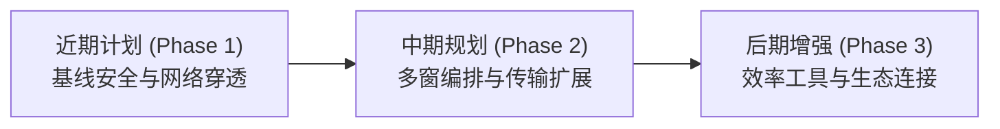

# KeiTerm 研发路线图 (Roadmap)

本文档规划了 **KeiTerm** 的后续演进计划与版本路线。设计理念旨在抛弃传统工具（如 SecureCRT）冗余陈旧的历史包袱，避开 Electron 类客户端的笨重资源消耗，结合现代 DevOps 工程师的实际工作流，聚焦**高可用网络穿透、直观交互、安全凭据与轻快体验**。

---

## 路线概览与阶段目标

---

## Phase 1：近期计划（基线安全、网络穿透与终端核心体验）

本阶段主要打通内网/云原生运维刚需网络链条，补全基线安全闭环，完善终端核心查找与阅读体验。

### 1. 网络穿透与拓扑打通

- **Jump Host（跳板机 / ProxyJump）网络链条**
  - 基于现有的 `JumpHostSessionId` 架构定义，在 `Kei.Term.Ssh` 中打通二级隧道连接；
  - 支持通过前置 SSH 会话建立 DirectTCPIP 通道直连目标机，解决企业内网与云堡垒机登录刚需。
- **可视化端口转发与隧道管理器（Port Forwarding Manager）**
  - 参考 Xshell 与 MobaXterm 的优秀操作体验（规避 SecureCRT 复杂的配置链路）；
  - 提供直观的 Local（本地转发）、Remote（远程转发）、Dynamic（动态 SOCKS5 代理）隧道配置与状态监控面板；
  - 支持一键启停、端口冲突检测与随会话自动挂载。

### 2. 基线安全与信任管理

- **主机密钥指纹校验与 `known_hosts` 信任库**
  - 首次连接目标服务器时，弹出主机公钥指纹（SHA-256 / MD5）确认对话框；
  - 独立持久化存储 `known_hosts` 列表；
  - 主机密钥发生变更时强力阻断连接并弹出安全篡改警示（防范中间人攻击 MITM）。

### 3. 终端核心阅读与检索

- **终端内搜索查找（Find in Terminal / Ctrl+F）**
  - 支持在终端当前屏幕与历史滚动缓冲区中即时检索；
  - 支持大小写匹配、正则搜索、上下条高亮跳转与匹配计数展示。
- **关键字规则着色（Keyword Highlighting）**
  - 支持用户自定义高亮词汇与正则规则；
  - 自动对常见日志词汇（如 `error` / `fail` 标红，`success` / `ok` 标绿，IP 地址/URL 强调显示）进行实时染色。

---

## Phase 2：中期规划（界面编排协同、传输扩展与用户掌控的云同步）

本阶段重点优化复合工作界面，扩充常用传输协议，并将已设计的端到端加密同步方案落地。

### 1. 界面编排与终端分屏

- **终端多窗格分屏（Split Panes：横向 / 纵向）**
  - 结合现有的平铺伴随式文件管理器（`RemoteFileManagerView`）进行统一布局编排；
  - 支持单标签页内终端水平分割、垂直分割与等比缩放；
  - 终端分屏网格与文件管理侧栏平滑协同，支持随窗口自适应重算 PTY 尺寸。

### 2. 命令行传输协议补充

- **ZMODEM（rz / sz）命令行文件传输**
  - 拦截并解析终端数据流中的 Zmodem 握手协议；
  - 输入 `rz` 自动唤起本地文件选择对话框并流式上传；
  - 输入 `sz <filename>` 自动接收文件并写入默认下载目录。

### 3. 用户掌控的端到端加密云同步（E2EE Cloud Sync）

- **零知识加密同步引擎**
  - 依据已制定的规范，采用 AGE 密码学算法标准（分块流式 AEAD 加密）；
  - 将云存储介质选择权彻底交给用户：支持 WebDAV、S3 兼容对象存储、自建服务器或本地目录同步；
  - 会话目录树与配置同步，敏感凭据仅在本地使用主密码或设备硬件解密。

### 4. 终端排版与字体微调

- **字体独立调节弹窗与排版优化**
  - 弹窗形式配置字体家族、字重（FontWeight）与基线间距；
  - 支持 Ctrl+滚轮缩放终端字号。

---

## Phase 3：后期增强（操作片段、自动化辅助与环境联动）

本阶段作为增强型功能储备，面向需要精细化交互的进阶场景。

### 1. 效率工具集

- **快捷指令栏与命令片段（Quick Commands & Snippets）**
  - 整合 Xshell 底部快捷按钮栏与现代 Snippets 参数化模板；
  - 支持常用诊断命令、脚本一键发送至终端。
- **多会话命令广播发送（Command Broadcast / Multi-Execution）**
  - 在底部撰写栏（Compose Bar）增加广播发送切换；
  - 支持一键将输入内容镜像发送至当前所有已连接标签页或选定标签页。

### 2. 环境深度感知与轻量监控

- **跟随终端当前工作目录（Follow Terminal CWD）**
  - 基于 Shell Integration 或终端 OSC 7 转义序列捕获路径变更；
  - 文件管理侧栏自动跳转至终端内 `cd` 后的实时路径。
- **轻量级远程系统监控（System Metrics Dashboard）**
  - 独立抽屉或轻量图表展示远程主机的实时 CPU、内存及网络负载。

---

## 设计哲学与功能舍弃原则

为了保持 KeiTerm 的专注与轻快，以下方向明确**不作为主要建设目标**：

1. **不做臃肿的遗留脚本堆砌**：不引入 VBScript / 复杂内部自动化宏，现代批量化运维推荐交由 Ansible/Terraform 等专业工具。
2. **不做过度激进的破坏性交互**：保持经典的树状多层资产目录与标准终端操作习惯，不强行采用强制联网的 AI Agent 命令接管。
3. **坚持原生桌面质感**：坚持 Avalonia 原生渲染与轻量内存开销，坚决避免引入 Web/Electron 容器。
