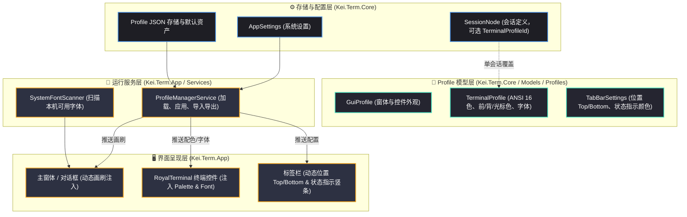

# KeiTerm Profile 系统、终端调色盘、字体选择与标签栏增强设计规范

## 1. 概述与背景

KeiTerm 在前序阶段已完成主界面层级解耦（顶部菜单栏横贯、全局工具栏、左侧连接管理器独立分列）。然而，目前界面的外观体系与终端配色紧耦合，缺乏成套的 Profile 系统；终端字体仍依赖手动打字输入；标签栏形态单一且缺少状态指示与排序能力；工具栏部分图标栅格不够整齐。

本设计旨在建立高内聚、低耦合的外观与终端配置架构，全量落地以下核心能力：
1. **GUI 外观与终端配色彻底解耦**：分别建立 `GuiProfile` 与 `TerminalProfile` 体系，支持全局默认与单会话单独覆盖。
2. **丰富的预制经典调色盘**：
   - GUI: VS Code Dark, One Dark, Nord, Solarized Dark 等。
   - 终端: Monokai, Dracula, Gruvbox, Solarized Dark/Light, Tomorrow Night 等 ANSI 16 色方案。
3. **终端核心颜色自由调控**：前景色默认采用纯白/高对比白（`#FFFFFF`），支持前景、背景、光标独立微调。
4. **系统字体动态扫描器**：彻底废除手动文本输入，利用 Avalonia `FontManager` 扫描本机字体，提供置顶等宽列表、字重（FontWeight）、斜体（FontStyle）开关与实时预览。
5. **SecureCRT 风格连接状态竖条**：废除现有 8px 小圆点，改用左边缘圆角细竖条呈现连接中、已连接、断开、错误四种状态，状态颜色在设置中可自由调整。
6. **Konsole 风格标签栏置顶/置底**：支持在系统设置中切换标签条在终端上方（Top）或下方（Bottom）。
7. **标签页水平拖拽重排**：支持拖拽标签左右调整顺序。
8. **配置导入与导出 (JSON)**：一键备份与恢复全部 Profile、配色及设置。
9. **工具栏图标栅格统一规范**：统一 16x16 / 20x20 视口几何，统一笔触与留白。

---

## 2. 架构设计与数据模型

### 2.1 整体分层与数据流



### 2.2 核心数据模型定义 (Kei.Term.Core)

> **关于属性默认值的说明**：下述属性上的初始硬编码值仅作为 **`[Fallback Default 安全兜底值]`**（防御老版本或损坏的 JSON 缺失字段，以及新建空 Profile 时的初始底色）。真正的官方预制调色盘（VS Code Dark, One Dark, Monokai, Dracula 等）统一由专用的静态注册工厂 `BuiltInPresets` 显式构造并声明，未来新增官方预置或扩充上色槽位（如不同窗体边框、标签高亮等）只需在模型添加可空/兜底字段并在注册工厂扩充即可。

#### A. GUI 外观配置: `GuiProfile`
```csharp
namespace Kei.Term.Core.Models.Profiles;

public sealed class GuiProfile
{
    public string Id { get; set; } = Guid.NewGuid().ToString();
    public string Name { get; set; } = string.Empty;
    public bool IsBuiltIn { get; set; }

    // 核心色系定义（仅作为缺省时的 Fallback 兜底，十六进制 RGB/RGBA）
    public string WindowBackground { get; set; } = "#181818";
    public string PanelBackground { get; set; } = "#1F1F1F";
    public string PanelAltBackground { get; set; } = "#252526";
    public string BorderBrush { get; set; } = "#2D2D2D";
    public string PrimaryText { get; set; } = "#CCCCCC";
    public string SecondaryText { get; set; } = "#858585";
    public string AccentColor { get; set; } = "#0E639C";
    public string AccentHover { get; set; } = "#1177BB";
}
```

#### B. 终端配色与字体配置: `TerminalProfile`
```csharp
namespace Kei.Term.Core.Models.Profiles;

public sealed class TerminalProfile
{
    public string Id { get; set; } = Guid.NewGuid().ToString();
    public string Name { get; set; } = string.Empty;
    public bool IsBuiltIn { get; set; }

    // 核心基础色（仅作为缺省时的 Fallback 兜底，前景色默认纯白）
    public string Foreground { get; set; } = "#FFFFFF";
    public string Background { get; set; } = "#1E1E1E";
    public string CursorColor { get; set; } = "#FFFFFF";
    public string SelectionBackground { get; set; } = "#264F78";

    // ANSI 16 色矩阵 (0-7 Normal, 8-15 Bright)
    public string[] AnsiColors { get; set; } = new string[16];

    // 字体相关（Fallback 兜底）
    public string FontFamily { get; set; } = "Cascadia Mono, Consolas, monospace";
    public double FontSize { get; set; } = 14.0;
    public string FontWeight { get; set; } = "Normal"; // Normal, Medium, SemiBold, Bold 等
    public bool IsItalic { get; set; } = false;
    public double LineHeight { get; set; } = 1.2;
    public bool CursorBlink { get; set; } = true;
}
```

#### C. 标签栏配置: `TabBarSettings`
```csharp
namespace Kei.Term.Core.Models.Profiles;

public enum TabPlacement
{
    Top,
    Bottom
}

public sealed class TabBarSettings
{
    public TabPlacement Placement { get; set; } = TabPlacement.Top;

    // 连接状态色（十六进制），供左侧竖条呈现
    public string ConnectingColor { get; set; } = "#FFA500";   // 橙/黄
    public string ConnectedColor { get; set; } = "#22C55E";    // 绿
    public string DisconnectedColor { get; set; } = "#3B82F6"; // 蓝/灰
    public string ErrorColor { get; set; } = "#EF4444";        // 红
}
```

#### D. 单会话绑定扩展 (`SessionNode`)
在 `src/Kei.Term.Core/Models/TreeNodes.cs` 的 `SessionNode` 中补充：
```csharp
// 可选指定的终端 Profile ID。若为 null 或空，则继承全局默认 TerminalProfile
public string? TerminalProfileId { get; set; }
```
在 SQLite 仓储（`SqliteTreeRepository`）中，在 `session_details` 表结构增加 `terminal_profile_id TEXT` 字段并完成持久化读写。

---

## 3. 子系统详细设计

### 3.1 预制调色盘 (Built-in Presets)

系统内置两组独立静态只读预置：

1. **GUI 预置**：
   - **Kei Classic (默认)**：经典 VS Code 深色调（`#181818`, `#1F1F1F`, `#0E639C`）。
   - **One Dark**：Atom/VSCode One Dark（`#282C34`, `#21252B`, `#61AFEF`）。
   - **Nord**：冷色调极地北欧风（`#2E3440`, `#3B4252`, `#88C0D0`）。
   - **Solarized Dark**：深青黄底色（`#002B36`, `#073642`, `#268BD2`）。
2. **终端预置 (ANSI 16 色 + 前背光标)**：
   - **Monokai (高对比纯白)**：前景 `#FFFFFF`，背景 `#272822`，辅以经典的亮粉、青、黄、紫等 ANSI 色。
   - **Dracula**：前景 `#F8F8F2`，背景 `#282A36`，光标 `#F8F8F2`，吸血鬼标志性紫粉高亮。
   - **Gruvbox Dark**：复古暖调，前景 `#EBDBB2`，背景 `#282828`。
   - **Solarized Dark**：经典网络设备配色，前景 `#93A1A1`，背景 `#002B36`。
   - **Solarized Light**：明亮模式，前景 `#586E75`，背景 `#FDF6E3`。
   - **Tomorrow Night**：简洁优雅深色，前景 `#C5C8C6`，背景 `#1D1F21`。

### 3.2 字体动态扫描与选择器 (Font System)

针对手动打字痛点，设计 `SystemFontScanner`：
1. **调用源**：使用 `Avalonia.Media.FontManager.Current.SystemFontFamilies`。
2. **排序与置顶**：
   - 将名称包含 `Mono`, `Code`, `Console`, `Terminal`, `Cascadia`, `Fira`, `JetBrains` 的常见等宽字体检测置顶。
   - 其余字体按字母正序排列。
3. **UI 交互控件**：
   - 下拉框选择字体族（`ComboBox`）。
   - 字重下拉框（`FontWeight`：`Light`, `Regular/Normal`, `Medium`, `SemiBold`, `Bold`）。
   - 斜体复选框（`CheckBox`：是否启用 `FontStyle.Italic`）。
   - 实时预览区域：直接在设置面板提供一段多语言文字预览（`AaBbCc 012345 !@#$% 中文测试`），并应用选中的字体、字重与斜体。

### 3.3 标签栏与连接状态条 (Tabs & Connection State)

1. **连接状态枚举名称规范**：
   - 统一使用 **`ConnectionState`**（替代原本有歧义的 `TabStatus` 或草稿中容易误读的 `VMState`）：
     - `Connecting` (连接中)
     - `Connected` (已连接)
     - `Disconnected` (已断开)
     - `Error` (异常断开/错误)
2. **SecureCRT 风格状态指示条**：
   - 废除原先的 `<Ellipse Width="8" Height="8" .../>` 圆点。
   - 标签左边缘增加 `Border Width="3" Margin="0,2" CornerRadius="1"`。
   - 其 Background 绑定当前 Tab 的 `ConnectionState`，通过转换器获取 `TabBarSettings` 中配置的颜色。
3. **Konsole 风格标签条上下切换**：
   - `MainWindow.axaml` 中终端区内容容器与标签条容器使用单列多行 Grid。
   - 标签条与终端区的 `Grid.Row` 属性根据 `TabBarSettings.Placement` 动态联动：
     - `Top` 时：标签条在 Row 0，终端区在 Row 1。
     - `Bottom` 时：终端区在 Row 0，标签条在 Row 1。
4. **水平拖拽重排 (Tab Reordering)**：
   - 标签按钮附加指针按下与移动事件。当拖拽位移超过 6px 时，发起 `DoDragDropAsync`，携带当前 Tab 对象的索引。
   - 目标 Tab 监听 `DragOver` 与 `Drop`，完成 `Tabs.Move(fromIndex, toIndex)`，保持当前激活状态不变。

### 3.4 工具栏图标栅格与视觉对齐 (Icons)

1. **基准规范**：
   - 视口统一为 `16x16` 或 `20x20`。
   - 所有图标 Path 均以统一的 `StrokeThickness="1.5"` 或居中填充绘制。
2. **重构清单**：
   - 顶部工具栏：快速连接、断开、连接、身份密钥、设置、撰写栏开关、侧边栏开关。
   - 连接管理器树工具栏：新建文件夹、剪切、复制、粘贴、全部折叠。
   - 保证按钮的 `Width="28" Height="28"` 且图标在居中 `16x16` 盒子中，消除宽窄不一与粗细不匀。

### 3.5 导入与导出 (JSON Bundle)

提供全局配置备份：
- **Schema 定义**：
  ```json
  {
    "version": 1,
    "exportedAt": "2026-09-24T12:00:00Z",
    "guiProfiles": [ ... ],
    "terminalProfiles": [ ... ],
    "tabBarSettings": { ... },
    "selectedGuiProfileId": "...",
    "defaultTerminalProfileId": "..."
  }
  ```
- **导入机制**：
  - 导入时读取 JSON，验证 `version` 兼容性。
  - 支持“覆盖并替换”模式，或者“仅增量合并未包含的自定义 Profile”模式。

---

## 4. 边界约束与兼容性

1. **架构分层严格隔离**：
   - `Kei.Term.Core` 中仅包含数据模型（`GuiProfile`, `TerminalProfile`, `TabBarSettings`）以及 JSON 序列化辅助，严禁引入 Avalonia 或平台特定 API。
   - 字体扫描（`FontManager`）仅在 `Kei.Term.App` 内部作为 UI 服务实现。
2. **既有配置平滑迁移**：
   - `AppSettings` 增加相关 ID 字段，老版本升级时若字段为空，自动填充默认内置 Profile ID，不造成运行时崩溃或设置丢失。
3. **本地化完整性**：
   - 所有新界面文案、Profile 名称、设置项、提示词，统一进入 `Strings.resx` 并使用 `{loc:KeiString}` 引用。

---

## 5. 验收标准与测试矩阵

1. **单元测试 (`tests/Kei.Term.Tests`)**：
   - Profile 默认预置生成与合法性测试（ANSI 色数量、Hex 颜色合法性）。
   - JSON 导出与导入序列化/反序列化测试（保真度验证）。
   - `SessionNode` 扩展字段的 SQLite 增删改查单元测试。
2. **UI 与交互集成验收**：
   - 设置窗口中可顺畅选择系统等宽字体并展示文字预览。
   - 切换 GUI Profile 时窗体画刷立即无感生效。
   - 切换终端 Profile 时终端背景色、ANSI 色、高亮色及字体立即刷新。
   - 标签栏在顶部与底部之间切换布局自适应无异常。
   - 标签状态在四种连接状态下竖色条颜色准确匹配。
   - 标签水平拖拽可稳定交换位置且不丢失终端输入焦点。
   - 工具栏图标整齐规范，无变形或边缘裁切。
